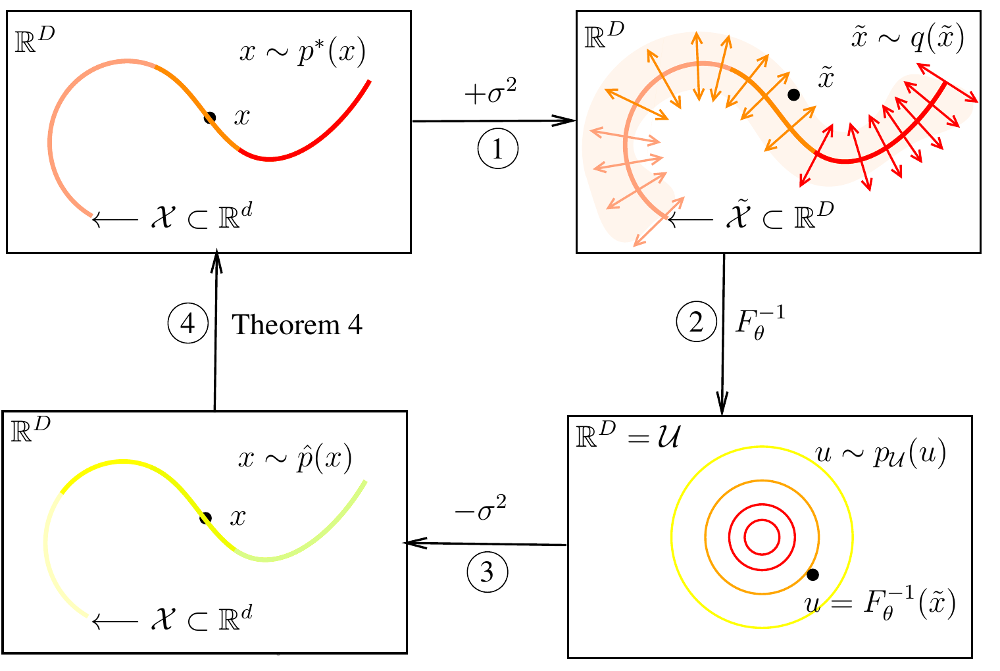

# Density estimation on low-dimensional manifolds: an inflation-deflation approach

*Christian Horvat and Jean-Pascal Pfister 2022*

We introduce a new method, named [inflation-deflation](https://arxiv.org/abs/2105.12152), to learn a density supported on a low-dimensional manifold. The idea is to exploit the ability of standard Normalizing Flows (NFs) to learn any density p(x) supported on entire embedding space. For that, we 

1. add noise to the data-manifold (inflation step),
2. train a standard NF (denoted as F in the figure above) to learn the inflated distribution,
3. scale the learned density to approximate p(x) (deflation step),
4. find conditions on the type of noise and on the manifold such that the approximation is exact (main Theorem).

Crucially, for step 4. the noise must be added in the manifolds normal space. Thus, the manifold must be known beforehand. However, we show that a standard Gaussian can be well used to approximate a Gaussian in the normal space whenever the manifold dimension d is much smaller than the dimensionality of the embedding space.

### Related Work

The inflation-deflation method ties in with the [Manifold Flow](https://github.com/johannbrehmer/manifold-flow),  introduced by Johann Brehmer and Kyle Cramner, to use NFs to learn densities supported on a low-dimensional manifold. 

### Experiments

We have shown that our method performes well on a wide range of manifolds:

manifold | data dimension | manifold dimension | argument to `--dataset` | argument to `--latent_distribution` 
--- | --- | --- | --- | ---
Sphere | 3 | 2 | sphere | mixture, correlated
Torus | 3 | 2 | torus | mixture, correlated
Hyperboloid | 3 | 2 | hyperboloid | mixture, correlated, unimodal
Thin spiral | 2 | 1 | thin_spiral | exponential
Swiss Roll | 3 | 2 | swiss_roll | mixture, correlated
Hyperboloid-Sphere | 3 | 2 | spheroid | mixture, correlated
Stiefel, SO(2)| 4 | 1 | stiefel | mixture

To use the model for your data, you need to create a simulator (see [experiments/datasets](experiments/datasets)), and add it to [experiments/datasets/__init__.py](experiments/datasets/__init__.py). If you have problems with that, please don't hesitate to contact us. For the experiments on MNSIT, we used the original implementation of the [Manifold Flow](https://github.com/johannbrehmer/manifold-flow), see [experiments/MNIST](experiments/MNIST) for the necessary additions. Everything necessary to re-plot the figures from the paper can be found in [experiments/plotting](experiments/plotting).

### Training & Evaluation & Figures

The configs for the sphere can be found in [experiments/configs](experiments/configs). To train the model on a cluster, please consider [experiments/cluster](experiments/cluster). Experiments on other manifolds can be adapted appropriate.

### Acknowledgements

We thank Johann Brehmer and Kyle Cramner for publishing their implementation of the [Manifold Flow](https://github.com/johannbrehmer/manifold-flow). Our code is partially based on their implementation. As standard NF, we have mainly used the [Block Neural Autoregressive Flow](https://github.com/nicola-decao/BNAF) which was re-implemented [here](https://github.com/kamenbliznashki/normalizing_flows) and served as inspiration for our main script.
We thank the community for fostering the open-source culture.
